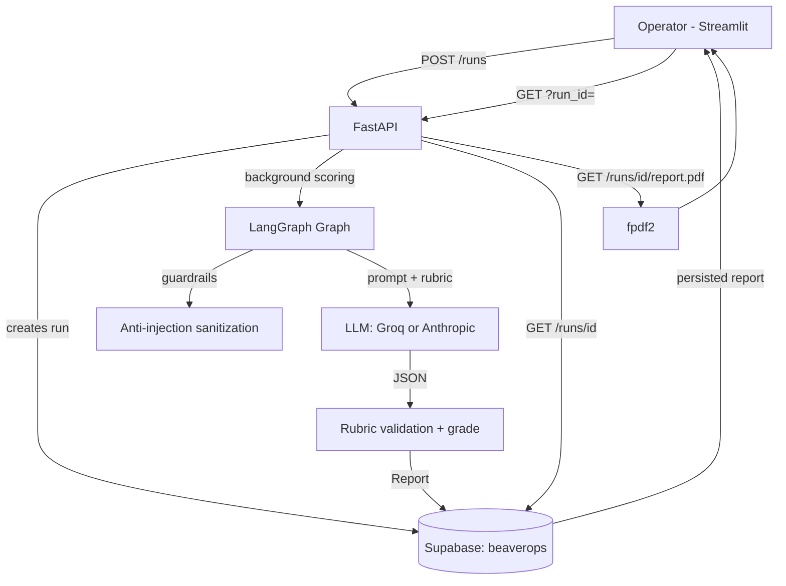

# Scoring System

An operator emulator: paste a call transcript, indicate whether it is a
*kick-off* or *coaching* call, and the system scores it against the matching
rubric (12 dimensions, 100 pts) and returns a downloadable PDF report.
- App url: https://beavermind.onrender.com/

## Overview

- **What it is:** a web application (FastAPI + LangGraph + Streamlit) that
  evaluates sales calls against "Halden Method" rubrics using an LLM, with
  deterministic validation of results.
- **Who uses it:** operators/coaches reviewing kick-off and coaching call
  quality.
- **What it does:** receives a transcript, routes it to the correct rubric,
  scores it dimension by dimension with cited evidence, computes grade and
  band, persists the result and serves it as a PDF.
- **Why it exists:** remove slow, subjective manual call evaluation,
  leaving traceable, persistent evidence per run.

## What Problem Does It Solve?

- **Current problem:** manually evaluating a call against a 12-dimension
  rubric takes a long time and depends on each reviewer's judgment.
- **Existing workflow:** the coach listens to/reads the call, crosses each
  dimension with the markdown rubric, assigns points, writes feedback and
  delivers it in a document.
- **Pain point:** slowness, inconsistency between reviewers and lack of
  cited evidence supporting each score.
- **Consequence:** late or superficial feedback; coaches have no concrete,
  prioritized action per call.
- **Improvement:** the operator pastes the transcript and in ~1 minute gets
  a consistent report (same rules for everyone), with cited evidence, "the
  one thing", brief, red flags and quick fix per dimension — downloadable
  as a PDF and accessible via persistent URL.

## Business Rules

| Rule | Description | Enforcement |
|------|-------------|-------------|
| BR-001 | Every run has a unique, persistent URL; the report is retrieved without re-scoring | `run_id` UUID is primary key in Supabase; `?run_id=` in the dashboard reads stored data |
| BR-002 | A failed run must expose why it failed | `error_reason` mandatory when `status=failed` (validation in `src/schemas.py`) |
| BR-003 | Scores are validated against the rubric: per-dimension max, valid bands and automatic caps | `build_report` in `src/scoring.py` validates in code; the LLM never computes totals or bands |
| BR-004 | Only dimension D4 (coaching) is optional; disabled it lowers the max to 85 | Validation rejects `disabled` on any other dimension; grade computed out of 85 |
| BR-005 | The transcript is untrusted data: it cannot instruct the model | `sanitize.py` removes control/invisible characters and injection-pattern lines (audited in `sanitization_flags`); the prompt frames it between delimiters |
| BR-006 | Empty transcript or fewer than 4 speaker turns → run `failed` with cause | `guardrail_node` before any LLM call |
| BR-007 | Every non-optional dimension must have a score; evidence must cite transcript lines | JSON contract in the prompt + validation + single retry (`score_transcript`) |
| BR-008 | Scoring survives tab closing | Background execution in the API + persistence in Supabase |
| BR-009 | The PDF only exists for `completed` runs | `GET /runs/{id}/report.pdf` answers 409 with an explanation in any other state |
| BR-010 | The call type determines the rubric | LangGraph router with conditional kickoff/coaching edge |
| BR-011 | Incomplete configuration prevents startup, naming the missing variable | `get_settings` fails fast with an explicit `ConfigError` |

## System Design

### Components

- **API (FastAPI, `src/api/`)** — receives `POST /runs` (transcript +
  call_type), creates the run and triggers scoring in the background; exposes
  `GET /runs/{id}` (status/report/cause) and `GET /runs/{id}/report.pdf`.
  Depends on Supabase and the LLM client.
- **LangGraph graph (`src/agent/`)** — orchestrates the flow: router →
  guardrails → scorer (kickoff|coaching). Typed state in `state.py`;
  pure testable nodes in `nodes.py`; sanitization in `sanitize.py`.
- **Scoring engine (`src/scoring.py`)** — builds the prompt (rubric +
  framed transcript + JSON contract), validates output against the rubric
  (caps, bands, optional D4), computes grade/band locally and retries once
  on contract violations.
- **LLM clients (`src/llm_client.py`)** — Groq and Anthropic without
  external dependencies, injectable HTTP transport, explicit errors,
  truncated-JSON retry. Selectable via `LLM_PROVIDER`.
- **Persistence (Supabase, `src/database/`)** — table `beaverops` as the
  single source of truth: status, transcript, report JSON, error_reason,
  timestamps. Repository with an injectable protocol (in-memory for tests).
- **PDF (`src/pdf_creation/`)** — deterministic render of the `Report` to
  PDF with fpdf2 following `pdf_format.md`.
- **Dashboard (Streamlit, `src/frontend/`)** — operator UI: create
  evaluation, live status, full report, PDF download and opening runs by
  persistent URL (`?run_id=`).

### Architecture



### Data flow

1. The operator pastes the transcript and picks kick-off/coaching; the
   dashboard issues `POST /runs` and shows the run's **persistent URL**.
2. The API creates the run (`pending`) in Supabase and runs the graph in a
   background thread (`scoring`).
3. Guardrails: anti-injection sanitization + minimum turn count; any
   failure leaves the run `failed` with `error_reason` before spending
   tokens.
4. The scorer builds the prompt, calls the LLM and validates the JSON
   against the rubric (bounded retries on truncated JSON or contract
   violations).
5. The validated `Report` is persisted (`completed`); the dashboard polls
   until it sees it and offers the PDF. The run URL keeps serving the report
   from Supabase indefinitely, without re-scoring.

## Technology Stack

- **Language:** Python 3.11+, managed with `uv`
- **API:** FastAPI + uvicorn
- **Orchestration:** LangGraph
- **Models:** Pydantic v2 (domain and wire schemas)
- **LLM:** Groq (`groq/compound-mini`, GPT-OSS 120B) or Anthropic
  (`claude-sonnet-5`, `claude-opus-5`), selectable via environment
- **Persistence:** Supabase (PostgreSQL + PostgREST)
- **PDF:** fpdf2
- **Frontend:** Streamlit (HTTP client with `MockTransport` for tests)
- **Tests:** pytest (138 tests, no network or real credentials)

## Quickstart

```bash
# 1. Credentials (.env)
cat > .env <<'EOF'
SUPABASE_PROJECT_ID=<project-ref>
SUPABASE_API_KEY=<anon key>
SUPABASE_SECRET_KEY=<service-role key>
LLM_PROVIDER=anthropic            # groq | anthropic
ANTHROPIC_API_KEY=<sk-ant-...>
ANTHROPIC_MODEL=claude-opus-5
# GROQ_API_KEY=<groq key>         # required if LLM_PROVIDER=groq
EOF

# 2. Create the table in Supabase (SQL Editor) from src/database/schema.sql

# 3. Run (separate terminals)
uv run python -m src.api.server            # API on :8000
uv run streamlit run src/frontend/app.py   # dashboard on :8501
```

## Engineering Decisions (and trade-offs)

1. **Coaching rubric adjusted 105 → 100.** The rubric declared 100 pts but
   added up to 105 (D6 was worth 15). D6 was reduced to 10 pts so it matches
   what the rubric itself declares (100 with D4, 85 without).
   *Trade-off:* D6 buckets differ from the original markdown, which was not
   touched to avoid altering the input.

2. **No transcript length limit.** The original guardrail failed runs over
   60k chars; real transcripts (~68k) triggered it. Any length is now
   accepted and the prompt layer truncates at
   `PROMPT_TRANSCRIPT_BUDGET_CHARS` with an explicit marker. Anti-injection
   sanitization stays intact. *Trade-off:* on Groq free tier the TPM sets
   the effective budget (see Limitations).

3. **Supabase table as-is (`beaverops`, `updatet_at`).** The repository maps
   `updatet_at` ↔ `updated_at` (typo included) instead of demanding a DDL
   migration. *Trade-off:* we live with the typo; mapping is centralized
   and tested.

4. **Bounded retries on LLM failures.** (a) JSON truncated by rate-limit
   variance → 1 retry after 15 s; (b) rubric contract violated (e.g.
   disabling D12) → 1 retry (`score_transcript`);
   (c) if it persists, run `failed` with an explicit cause. *Trade-off:* a
   run can take up to ~2× longer to fail definitively; in exchange most
   transient failures recover on their own.

5. **Strict output validation.** Out-of-range scores, invalid bands or
   illegally disabled dimensions reject the run. *Trade-off:* more `failed`
   runs with a clear cause instead of silent incorrect reports.

6. **Background scoring + polling.** `POST /runs` responds 201 immediately.
   *Trade-off:* the work lives in the API process (no external queue); a
   restart mid-scoring leaves the run orphaned in `scoring`.

7. **LLM clients without an external SDK.** urllib + injectable transport.
   *Trade-off:* a bit more in-house code in exchange for zero dependencies
   and network-free tests.

8. **Adjustments discovered during real testing (documented in code):**
   Cloudflare rejects urllib's User-Agent against Groq (error 1010) → custom
   UA; `exclude-newer` in `pyproject.toml` broke uv → removed;
   Claude Opus 5 deprecated `temperature`, needs `max_tokens=32000` and a
   600 s timeout for long transcripts.

## Reliability

- Every failure is explicit and persisted: `error_reason` visible in the
  API and dashboard (BR-002).
- Retries at two levels (transport/JSON and rubric contract) with fixed
  bounds; never a bare `except`.
- Guardrails before spending tokens: empty, too short, injection.
- Full state in Supabase: the API is stateless and can restart without
  losing completed runs.
- The 138-test suite runs in seconds with no network or credentials.

## Testing

- `uv run pytest` — 138 tests: schemas/config, rubrics, LLM client (fake
  transport), graph and guardrails, scoring (validation, caps, D4, retries,
  truncation), repository (in-memory + fake Supabase), API (6 cases with
  injected dependencies), PDF (`%PDF` bytes, sections), E2E with
  deterministic stubs for kickoff and coaching, dashboard client.
- Real E2E verification executed with real credentials: 68k-char transcript
  → `completed` (Opus 5) → 5-page PDF; failure path with a visible cause.

## Limitations

- **Groq free tier:** 8k TPM on gpt-oss-120b forces truncating long
  transcripts (compound-mini raises it to 70k TPM but only 250 req/day).
- **In-process scoring:** no external queue; an API crash mid-scoring
  leaves the run in `scoring` (no recovery worker).
- **No auth:** the API is open and uses the service-role key server-side;
  internal use/development only.
- **`updatet_at` column** without timezone in Supabase (mapped in code).
- **Polling** every 2 s from the dashboard (no push).

## Scaling Options

**LLM capacity**

- *Groq Dev Tier* (250k TPM) or Anthropic: removes truncation and rate
  limits without changing code.
- *Multi-pass chunk scoring:* extract evidence per chunk and score in a
  final consolidated pass — full coverage even on free tier; cost: 2–3×
  calls per run.
- *Prompt caching:* rubric + contract are identical across runs; providers
  with caching reduce cost/latency.

**Reliability and volume**

- *External queue* (RQ/Celery/Redis or Supabase Queues) instead of the
  in-process thread: runs survive restarts, retries with backoff, horizontal
  API without sticky sessions.
- *Webhooks/SSE* instead of polling.
- *Exponential backoff honoring `Retry-After`* in the LLM client.

**Product and operations**

- *Auth + RLS* (Supabase Auth) before exposing beyond the team.
- *Per-operator/client history* (`coach`/`client`/`program` fields from
  `design-mocks/`) and cross-run comparison.
- *Observability:* traces per graph node, tokens/cost per run, alerts on
  the `failed` rate.
- *Cached PDF* in Supabase Storage if download volume grows.

## Deploy (Render)

Both services deploy from one [`render.yaml`](render.yaml) blueprint
(Render → New → Blueprint → pick this repo):

- **scoring-api** — FastAPI served by uvicorn:
  `uvicorn src.api.server:app --host 0.0.0.0 --port $PORT`
- **scoring-dashboard** — Streamlit UI:
  `streamlit run src/frontend/app.py --server.port $PORT --server.address 0.0.0.0 --server.headless true`,
  with `SCORING_API_URL` wired automatically to the API service host.

Set these environment variables (both services read them at startup):
`SUPABASE_PROJECT_ID`, `SUPABASE_API_KEY`, `SUPABASE_SECRET_KEY`, and the
provider key (`GROQ_API_KEY` by default, or `ANTHROPIC_API_KEY` +
`LLM_PROVIDER=anthropic`). No `SCORING_MODE` override needed: Render
services are long-lived processes, so the default background scoring works.

Run URLs stay persistent forever because reports live in Supabase, not in
the deployment.

## Development

- Workflow: Spec Driven Development — `docs/specs.md`; features and states
  in `settings_files_tasks.json`; one feature at a time, spec approved
  before coding.
- Structure: `specs/<feature>/`, `progress/`, `design-mocks/`,
  `docs/ADR.md` (decision log), `skills/` (security-review,
  engineering-readme).
- Verification: `uv run pytest` before considering a change done.
