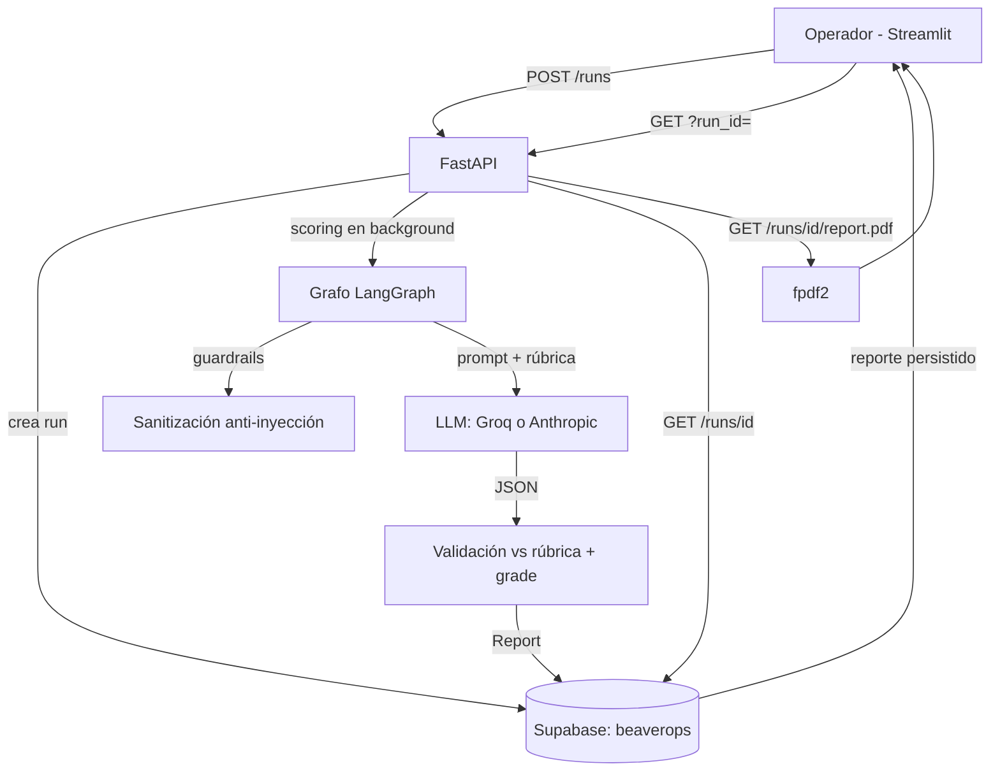

repo: https://github.com/lukecala/hiring-ai-dev-exercise

# Scoring System

Emulador de operador: pega un transcript de llamada, indica si es *kick-off*
o *coaching*, y el sistema lo puntúa contra la rúbrica correspondiente
(12 dimensiones, 100 pts) y devuelve un reporte descargable como PDF.

## Overview

- **Qué es:** una aplicación web (FastAPI + LangGraph + Streamlit) que
  evalúa llamadas de ventas contra rúbricas del "Halden Method" usando un
  LLM, con validación determinista de resultados.
- **Quién lo usa:** operadores/coaches que revisan la calidad de llamadas
  kick-off y coaching.
- **Qué hace:** recibe un transcript, lo enruta a la rúbrica correcta, lo
  puntúa dimensión por dimensión con evidencia citada, calcula grade y
  banda, persiste el resultado y lo sirve como PDF.
- **Por qué existe:** eliminar la evaluación manual, subjetiva y lenta de
  llamadas, dejando evidencia trazable y persistente por run.

## What Problem Does It Solve?

- **Problema actual:** evaluar una llamada contra una rúbrica de 12
  dimensiones a mano toma mucho tiempo y depende del criterio de cada
  revisor.
- **Workflow existente:** el coach escucha/lee la llamada, cruza cada
  dimensión con la rúbrica markdown, asigna puntos, redacta el feedback y
  lo entrega en un documento.
- **Pain point:** lentitud, inconsistencia entre revisores y falta de
  evidencia citada que sostenga cada puntaje.
- **Consecuencia:** feedback tardío o superficial; los coaches no tienen
  una acción concreata y priorizada por llamada.
- **Mejora:** el operador pega el transcript y en ~1 minuto obtiene un
  reporte consistente (mismas reglas para todos), con evidencia citada,
  "the one thing", brief, red flags y quick fix por dimensión — descargable
  en PDF y accesible por URL persistente.

## Business Rules

| Rule | Description | Enforcement |
|------|-------------|-------------|
| BR-001 | Cada run tiene una URL única y persistente; el reporte se recupera sin re-scorear | `run_id` UUID es primary key en Supabase; `?run_id=` en el dashboard lee lo almacenado |
| BR-002 | Un run fallido debe exponer por qué falló | `error_reason` obligatorio cuando `status=failed` (validación en `src/schemas.py`) |
| BR-003 | Los puntajes se validan contra la rúbrica: máximo por dimensión, bandas válidas y caps automáticos | `build_report` en `src/scoring.py` valida en código; el LLM nunca calcula totales ni bandas |
| BR-004 | Solo la dimensión D4 (coaching) es opcional; deshabilitada el máximo pasa a 85 | Validación rechaza `disabled` en cualquier otra dimensión; grade calculado sobre 85 |
| BR-005 | El transcript es dato no confiable: no puede instruir al modelo | `sanitize.py` remueve caracteres de control/invisibles y líneas con patrones de inyección (auditadas en `sanitization_flags`); el prompt lo enmarca entre delimitadores |
| BR-006 | Transcript vacío o con menos de 4 turnos de hablante → run `failed` con causa | `guardrail_node` antes de cualquier llamada LLM |
| BR-007 | Toda dimensión no opcional debe tener score; la evidencia debe citar líneas del transcript | Contrato JSON en el prompt + validación + reintento único (`score_transcript`) |
| BR-008 | El scoring sobrevive al cierre de la pestaña | Ejecución en background en la API + persistencia en Supabase |
| BR-009 | El PDF solo existe para runs `completed` | `GET /runs/{id}/report.pdf` responde 409 con explicación en otro estado |
| BR-010 | El tipo de llamada determina la rúbrica | Router del grafo LangGraph con arista condicional kickoff/coaching |
| BR-011 | Configuración incompleta impide arrancar, nombrando la variable faltante | `get_settings` falla rápido con `ConfigError` explícito |

## System Design

### Components

- **API (FastAPI, `src/api/`)** — recibe `POST /runs` (transcript +
  call_type), crea el run y dispara el scoring en background; expone
  `GET /runs/{id}` (estado/reporte/causa) y `GET /runs/{id}/report.pdf`.
  Depende de Supabase y del cliente LLM.
- **Grafo LangGraph (`src/agent/`)** — orquesta el flujo: router →
  guardrails → scorer (kickoff|coaching). Estado tipado en `state.py`;
  nodos puros testeables en `nodes.py`; sanitización en `sanitize.py`.
- **Motor de scoring (`src/scoring.py`)** — construye el prompt (rúbrica +
  transcript enmarcado + contrato JSON), valida el output contra la rúbrica
  (caps, bandas, D4 opcional), calcula grade/banda localmente y reintenta
  una vez ante violaciones del contrato.
- **Clientes LLM (`src/llm_client.py`)** — Groq y Anthropic sin
  dependencias externas, transporte HTTP inyectable, errores explícitos,
  reintento de JSON truncado. Seleccionable con `LLM_PROVIDER`.
- **Persistencia (Supabase, `src/database/`)** — tabla `beaverops` como
  única fuente de verdad: estado, transcript, reporte JSON, error_reason,
  timestamps. Repositorio con protocolo inyectable (in-memory para tests).
- **PDF (`src/pdf_creation/`)** — render determinista del `Report` a PDF
  con fpdf2 según `pdf_format.md`.
- **Dashboard (Streamlit, `src/frontend/`)** — UI del operador: crear
  evaluación, estado en vivo, reporte completo, descarga PDF y apertura de
  runs por URL persistente (`?run_id=`).

### Architecture



### Data flow

1. El operador pega el transcript y elige kick-off/coaching; el dashboard
   hace `POST /runs` y muestra la **URL persistente** del run.
2. La API crea el run (`pending`) en Supabase y ejecuta el grafo en un hilo
   de background (`scoring`).
3. Guardrails: sanitización anti-inyección + mínimo de turnos; cualquier
   fallo deja el run `failed` con `error_reason` antes de gastar tokens.
4. El scorer construye el prompt, llama al LLM y valida el JSON contra la
   rúbrica (reintentos acotados ante JSON truncado o contrato violado).
5. El `Report` validado se persiste (`completed`); el dashboard hace polling
   hasta verlo y ofrece el PDF. La URL del run sigue sirviendo el reporte
   desde Supabase indefinidamente, sin re-scorear.

## Technology Stack

- **Lenguaje:** Python 3.11+, gestionado con `uv`
- **API:** FastAPI + uvicorn
- **Orquestación:** LangGraph
- **Modelos:** Pydantic v2 (schemas de dominio y de wire)
- **LLM:** Groq (`groq/compound-mini`, GPT-OSS 120B) o Anthropic
  (`claude-sonnet-5`, `claude-opus-5`), seleccionables por entorno
- **Persistencia:** Supabase (PostgreSQL + PostgREST)
- **PDF:** fpdf2
- **Frontend:** Streamlit (cliente HTTP con `MockTransport` para tests)
- **Tests:** pytest (137 tests, sin red ni credenciales reales)

## Quickstart

```bash
# 1. Credenciales (.env)
cat > .env <<'EOF'
SUPABASE_PROJECT_ID=<project-ref>
SUPABASE_API_KEY=<anon key>
SUPABASE_SECRET_KEY=<service-role key>
LLM_PROVIDER=anthropic            # groq | anthropic
ANTHROPIC_API_KEY=<sk-ant-...>
ANTHROPIC_MODEL=claude-opus-5
# GROQ_API_KEY=<groq key>         # requerido si LLM_PROVIDER=groq
EOF

# 2. Crear la tabla en Supabase (SQL Editor) con src/database/schema.sql

# 3. Arrancar (terminales separadas)
uv run python -m src.api.server            # API en :8000
uv run streamlit run src/frontend/app.py   # dashboard en :8501
```

## Engineering Decisions (y trade-offs)

1. **Rúbrica de coaching ajustada 105 → 100.** La rúbrica declaraba 100 pts
   pero sumaba 105 (D6 valía 15). Se redujo D6 a 10 pts para que cuadre con
   lo que la propia rúbrica declara (100 con D4, 85 sin D4).
   *Trade-off:* los buckets de D6 difieren del markdown original, que no se
   tocó para no alterar el insumo.

2. **Sin límite de longitud de transcript.** El guardrail original fallaba
   runs > 60k chars; los transcripts reales (~68k) lo disparaban. Hoy
   cualquier longitud se acepta y la capa de prompt trunca a
   `PROMPT_TRANSCRIPT_BUDGET_CHARS` con marcador explícito. La sanitización
   anti-inyección se mantiene intacta. *Trade-off:* con Groq free tier el
   presupuesto efectivo lo pone el TPM (ver Limitaciones).

3. **Tabla Supabase tal como existe (`beaverops`, `updatet_at`).** El
   repositorio mapea `updatet_at` ↔ `updated_at` (typo incluido) para no
   exigir una migración DDL. *Trade-off:* convivimos con el typo, mapeo
   centralizado y testeado.

4. **Reintentos acotados ante fallos del LLM.** (a) JSON truncado por
   varianza de rate limit → 1 reintento a los 15 s; (b) contrato de rúbrica
   violado (p. ej. deshabilitar D12) → 1 reintento (`score_transcript`);
   (c) si persiste, run `failed` con causa explícita. *Trade-off:* un run
   puede tardar hasta ~2× en fallar definitivamente; a cambio la mayoría de
   fallos transitorios se recuperan solos.

5. **Validación estricta del output.** Scores fuera de rango, bandas
   inválidas o dimensiones ilegalmente deshabilitadas rechazan el run.
   *Trade-off:* más runs `failed` con causa clara frente a reportes
   incorrectos silenciosos.

6. **Scoring en background + polling.** `POST /runs` responde 201 al
   instante. *Trade-off:* el trabajo vive en el proceso de la API (sin cola
   externa); un reinicio a mitad de scoring deja el run `scoring` huérfano.

7. **Clientes LLM sin SDK externo.** urllib + transporte inyectable.
   *Trade-off:* algo más de código propio a cambio de cero dependencias y
   tests sin red.

8. **Ajustes descubiertos en pruebas reales (documentados en código):**
   Cloudflare rechaza el User-Agent de urllib frente a Groq (error 1010) →
   UA propio; `exclude-newer` en `pyproject.toml` rompía uv → eliminado;
   Claude Opus 5 deprecó `temperature`, necesita `max_tokens=32000` y
   timeout de 600 s para transcripts largos.

## Reliability

- Todo fallo es explícito y persistido: `error_reason` visible en la API y
  en el dashboard (BR-002).
- Reintentos en dos niveles (transporte/JSON y contrato de rúbrica) con
  límites fijos; nunca `except` desnudo.
- Guardrails previos al gasto de tokens: vacío, muy corto, inyección.
- Estado íntegro en Supabase: la API es stateless y puede reiniciarse sin
  perder runs completados.
- Suite de 137 tests corre en segundos sin red ni credenciales.

## Testing

- `uv run pytest` — 137 tests: schemas/config, rúbricas, cliente LLM (fake
  transport), grafo y guardrails, scoring (validación, caps, D4, reintentos,
  truncado), repositorio (in-memory + fake Supabase), API (6 casos con
  dependencias inyectadas), PDF (bytes `%PDF`, secciones), E2E con stubs
  deterministas para kickoff y coaching, cliente del dashboard.
- Verificación E2E real ejecutada con credenciales reales: transcript de
  68k chars → `completed` (Opus 5) → PDF de 5 páginas; camino de fallo con
  causa visible.

## Limitations

- **Groq free tier:** 8k TPM en gpt-oss-120b obliga a truncar transcripts
  largos (compound-mini sube a 70k TPM pero solo 250 req/día).
- **Scoring in-process:** sin cola externa, un crash de la API durante el
  scoring deja el run en `scoring` (no hay worker de recuperación).
- **Sin auth:** la API es abierta y usa la service-role key server-side;
  solo apta para uso interno/desarrollo.
- **Columna `updatet_at`** sin timezone en Supabase (mapeada en código).
- **Polling** cada 2 s desde el dashboard (no hay push).

## Formas de escalar

**Capacidad de LLM**
- *Groq Dev Tier* (250k TPM) o Anthropic: elimina truncado y rate limits
  sin cambiar código.
- *Scoring por chunks multi-pasada:* extraer evidencia por chunk y puntuar
  en una pasada final consolidada — cobertura completa incluso en free
  tier; coste: 2-3× llamadas por run.
- *Prompt caching:* rúbrica + contrato son idénticos entre runs; los
  proveedores con caching reducen coste/latencia.

**Fiabilidad y volumen**
- *Cola externa* (RQ/Celery/Redis o Supabase Queues) en lugar del hilo
  in-process: runs sobreviven a reinicios, reintentos con backoff, API
  horizontal sin sesiones pegajosas.
- *Webhooks/SSE* en lugar de polling.
- *Backoff exponencial respetando `Retry-After`* en el cliente LLM.

**Producto y operación**
- *Auth + RLS* (Supabase Auth) antes de exponer fuera del equipo.
- *Historial por operador/cliente* (campos coach/client/program de
  `design-mocks/`) y comparativa entre runs.
- *Observabilidad:* trazas por nodo del grafo, tokens/coste por run,
  alertas sobre tasa de `failed`.
- *PDF cacheado* en Supabase Storage si crece el volumen de descargas.

## Deploy

**API en Vercel** (scoring síncrono):

1. Environment Variables en el dashboard de Vercel: las de `.env`
   (Supabase, LLM) **más `SCORING_MODE=sync`** — las funciones serverless se
   congelan tras la respuesta, así que el scoring corre inline y el `201`
   ya trae el estado final (`completed`/`failed`).
2. `vercel.json` fija `maxDuration=300` (requiere plan Pro para Opus con
   transcripts largos; en Hobby de 60 s usa `claude-sonnet-5`).
3. `requirements.txt` (export de uv) alimenta el runtime Python;
   entrypoint en `api/index.py`.

**Dashboard en Streamlit Community Cloud:**

- Repo + branch + `src/frontend/app.py`; en "Secrets" añade
  `SCORING_API_URL=https://<tu-app>.vercel.app`.
- Las URLs persistentes de los runs (`https://<streamlit-app>/?run_id=<uuid>`)
  siguen funcionando: el reporte vive en Supabase, no en el deploy.

## Desarrollo

- Workflow: Spec Driven Development — `docs/specs.md`; features y estados
  en `settings_files_tasks.json`; un feature a la vez, spec aprobada antes
  de codificar.
- Estructura: `specs/<feature>/`, `progress/`, `design-mocks/`,
  `docs/ADR.md` (log de decisiones), `skills/` (security-review,
  engineering-readme).
- Verificación: `uv run pytest` antes de dar un cambio por terminado.
